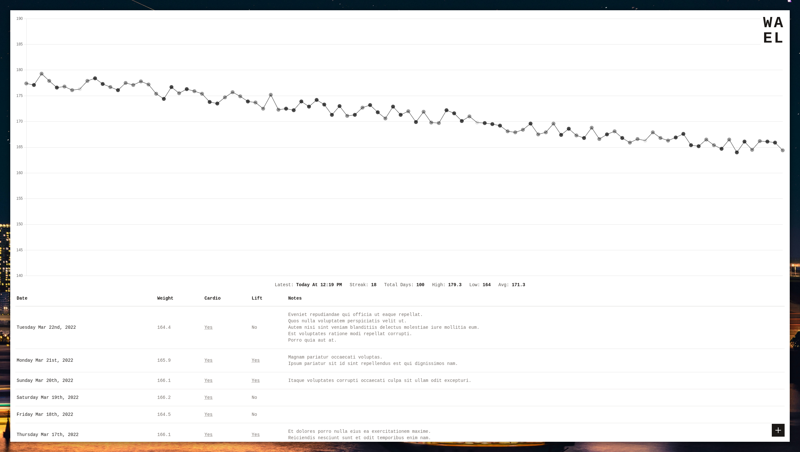
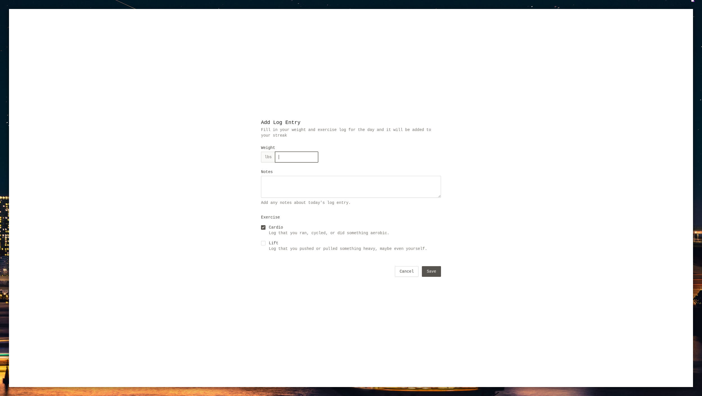
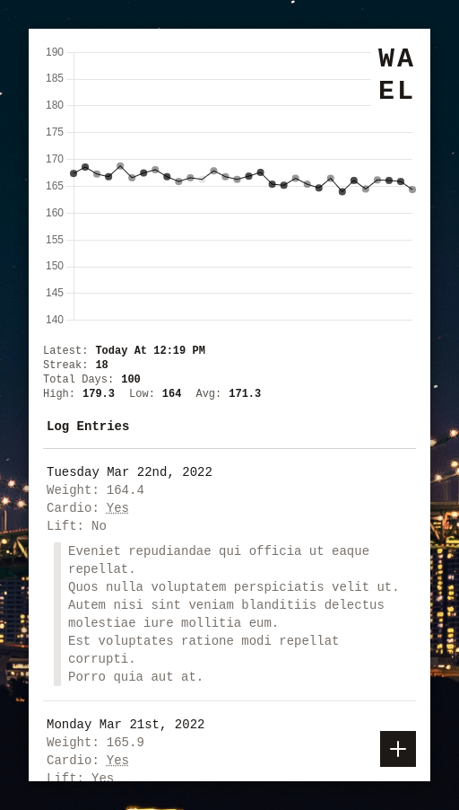
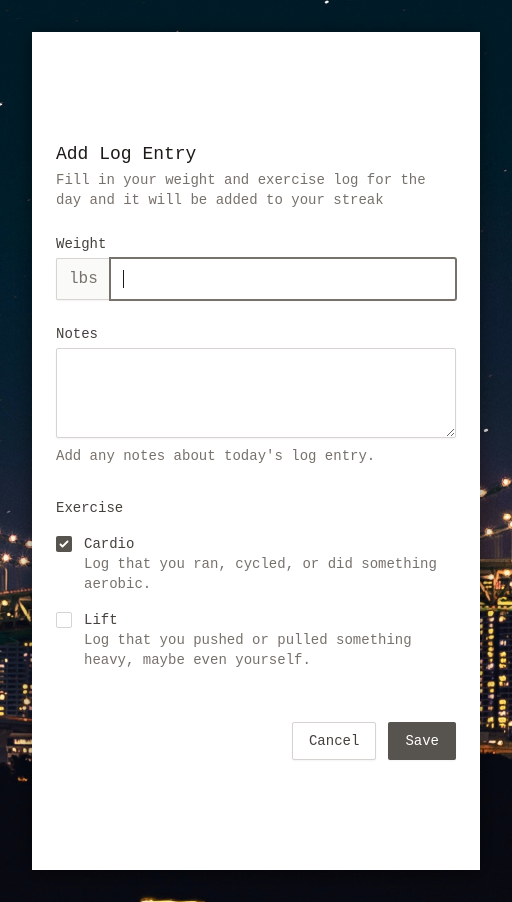

# WAEL - A simple self-hosted weight and exercise log 

---

`WAEL` is a _simple_ self-hosted weight and exercise log - track your weight and exercise over time with basic metrics and a handy little chart. It can be self-hosted with the provide `Dockerfile` and/or `docker-compose.yml`.

> **NOTE** - the `Docker` setup for this project has been specifically tailored to work on a `Raspberry PI`, and as such expects to run on `arm64` / `aarch64` processor architecture. If you want to run on your own `rpi`, make sure you are running a 64 bit version of your operating system because `prisma` (the ORM used in this project) requires it.

**Screenshots**

|                Chart & Stats (Desktop)                 |                  Log Entry (Desktop)                  |
| :----------------------------------------------------: | :---------------------------------------------------: |
|  |  |

|                Chart & Stats (Mobile)                |                 Log Entry (Mobile)                  |
| :--------------------------------------------------: | :-------------------------------------------------: |
|  |  |

This app is open source and licensed under the MIT license, so you can feel free to check out the source code or even contribute to make it better!

Enjoy the app and feel like saying thanks? Feel free to [buy me a coffee ☕](https://www.paypal.me/fluencyy)

## License

This project is licensed under the MIT License - see the [license file](LICENSE) for details.

## Building Locally

To build the app locally for development or testing:

1. Install `node` (and `yarn`)
2. `cd` into the project root directory and `yarn install`
3. Run `yarn run dev` to build the development version of the app with live file reloading.
4. Run `yarn run build` to build the production version of the app for hosting.
